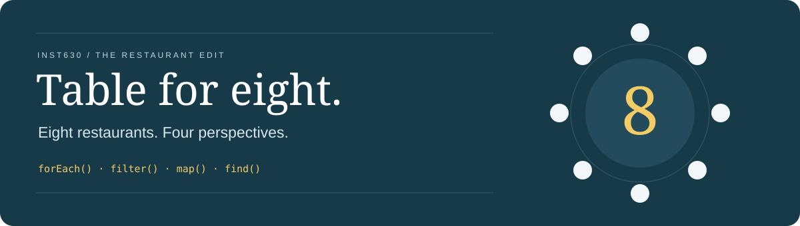
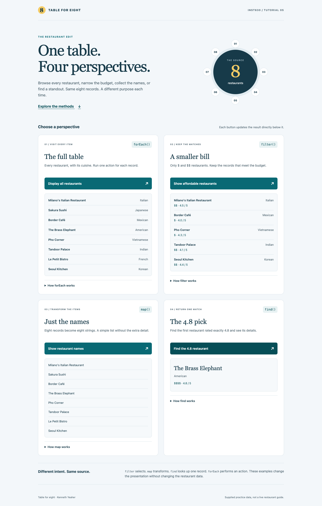
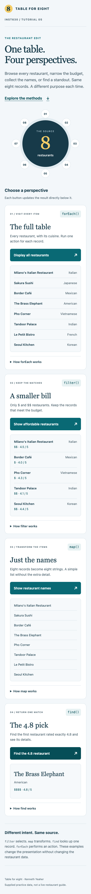

<p align="center">
  
</p>

<p align="center">
  <strong>A restaurant directory, viewed through four JavaScript array methods.</strong><br>
  Visit every record, narrow the budget, collect the names, and find the 4.8 pick.
</p>

<p align="center">
  
  
  
  
</p>

<p align="center">
  <a href="#class-requirements"><strong>Class requirements</strong></a> &nbsp; · &nbsp;
  <a href="#array-methods-and-intent">Array methods</a> &nbsp; · &nbsp;
  <a href="#run-locally">Run locally</a> &nbsp; · &nbsp;
  <a href="#verification">Verification</a>
</p>

---

## The interaction

An INST630 Tutorial 5 exercise built from the supplied restaurant starter files. The original eight records and all four button/result IDs are preserved. Each button processes the same collection and updates its own result area. Repeating an action replaces that view instead of duplicating the output.



<details>
<summary><strong>See the mobile layout</strong></summary>
<br>
<p align="center"></p>
</details>

## Class requirements

The four functions in [`script.js`](tutorial_5_arrays/script.js) demonstrate the required methods directly. Their results are checked in [`tests/arrays.test.cjs`](tests/arrays.test.cjs).

| Method      | Implementation                                                        | Expected result                                                                                        |
| ----------- | --------------------------------------------------------------------- | ------------------------------------------------------------------------------------------------------ |
| **forEach** | `displayAllRestaurants()` visits each record and creates a row        | All **8 names and cuisines**, in source order                                                          |
| **filter**  | `displayAffordableRestaurants()` keeps `priceRange === "$"` or `"$$"` | **5 restaurants:** Milano's Italian Restaurant, Border Café, Pho Corner, Tandoor Palace, Seoul Kitchen |
| **map**     | `displayRestaurantNames()` creates a new array of name strings        | A semantic list of **8 names**, without cuisine or rating                                              |
| **find**    | `displayFeaturedRestaurant()` matches `rating === 4.8`                | **The Brass Elephant**, American, **4.8 / 5**                                                          |

The designated result areas remain `#restaurant-list`, `#filtered-list`, `#mapped-list`, and `#found-item`. Native buttons and event listeners connect each action to its display.

## Array methods and intent

| Method    | Intent                                           | Return value                    | Useful interface pattern    |
| --------- | ------------------------------------------------ | ------------------------------- | --------------------------- |
| `forEach` | Perform an action for every item                 | `undefined`                     | Render every restaurant row |
| `filter`  | Keep items that satisfy a condition              | New array of matching records   | A budget view               |
| `map`     | Transform each item                              | New array of transformed values | A compact list of names     |
| `find`    | Locate the first item that satisfies a condition | Matching record, or `undefined` | A featured restaurant       |

A traditional loop can implement each operation. These method names make the purpose visible without index bookkeeping. `filter` and `map` can also be chained when a view needs both selection and transformation:

```js
const affordableNames = restaurants
  .filter((restaurant) => {
    return restaurant.priceRange === "$" || restaurant.priceRange === "$$";
  })
  .map((restaurant) => {
    return restaurant.name;
  });
```

This example returns five name strings. The assignment keeps the four operations separate so each one can be inspected on its own.

**Preserving the source requires care.** `filter` creates a new array, but its objects still refer to the original records. `find` also returns an existing record. Changing those objects could change the source. These implementations only read restaurant fields and create new DOM elements. `map` produces strings; `forEach` changes the page, not the data. None of the callbacks mutate the restaurant array or its records.

The 4.8 button is an exact lookup. Although 4.8 happens to be the highest rating in the supplied data, `find` does not calculate a maximum.

## Interface decisions

| Decision                         | Reason                                                                                                                                               |
| -------------------------------- | ---------------------------------------------------------------------------------------------------------------------------------------------------- |
| **Four titled sections**         | Keeps each task and result visible for comparison. This follows the _Titled Sections_ pattern in Chapter 4 of _Designing Interfaces_, third edition. |
| **Results beside their actions** | Each view appears directly beneath the button that created it.                                                                                       |
| **Optional method explanations** | Native disclosure controls reveal code and return values without hiding the required tasks.                                                          |
| **Lists matched to the data**    | Full records show cuisine; budget results add price; the mapped view contains names only.                                                            |
| **One column on small screens**  | Keeps the same reading order while giving the results room to wrap.                                                                                  |
| **Keyboard and status feedback** | Native buttons, visible focus, a skip link, and polite status regions support navigation and announce result changes.                                |

These are design decisions, not measured usability improvements. The page has not undergone a user study or a full assistive technology audit.

## Run locally

The page uses plain HTML, CSS, and JavaScript. It needs no build step, account, API key, or runtime package.

Open `tutorial_5_arrays/index.html` in a browser, or serve the repository with Python 3:

```sh
python3 -m http.server 8000
```

Visit [localhost:8000/tutorial_5_arrays/](http://localhost:8000/tutorial_5_arrays/). Click each of the four buttons and inspect the results. The repository's root page also forwards to the exercise.

## Verification

Development checks require **Node.js 22 or newer**. Playwright runs browser interactions; Prettier checks formatting. Both are development dependencies with exact versions recorded in the lockfile.

```sh
npm ci
npx playwright install chromium
npm run check
npm test
```

To use an existing Google Chrome installation instead of downloading Chromium:

```sh
BROWSER_CHANNEL=chrome npm test
```

The **10 local browser checks passed in headless Google Chrome**. They cover:

- Exact names, cuisines, affordable results, and the 4.8 match.
- Repeat clicks without duplicates and a deeply frozen source dataset.
- A missing 4.8 match, multiple matches, and empty data.
- Literal rendering of text that looks like HTML.
- Keyboard button activation and explanation disclosure.
- No horizontal page overflow at **320, 390, 768, and 1440 pixels**.
- The root page redirect and no captured console warnings, errors, or failed responses.

Desktop and mobile screenshots were inspected visually. The [browser workflow](.github/workflows/browser-checks.yml) runs the same checks with Chromium on GitHub Actions after publication. Local checks do not establish Safari or Firefox compatibility, screen reader behavior, or hosted workflow success.

To refresh the README screenshots while running the checks:

```sh
BROWSER_CHANNEL=chrome CAPTURE_PREVIEWS=1 npm test
```

## Project structure

```text
arrayMethods/
├── index.html                  # Entry point to the exercise
├── tutorial_5_arrays/
│   ├── index.html              # Four method sections and result areas
│   ├── script.js               # Supplied data and array method functions
│   ├── style.css               # Responsive layout and focus styles
│   └── favicon.svg             # Table mark
├── tests/arrays.test.cjs        # Browser behavior checks
├── docs/assets/                # README banner and browser previews
├── .github/workflows/          # Automated verification
└── package.json                # Development commands and dependencies
```

## Scope and sources

The restaurant names, ratings, prices, and contact fields are supplied practice data from **Tutorial 5: Array Methods for Data**, not verified restaurant information. The exercise has no backend, analytics, persistent storage, or network requests. The README badges are external images; the exercise itself uses local assets and system fonts.

The starter is preserved in the first commit. Later commits record implementation, interface work, verification, and documentation. No license has been added to the supplied course materials because redistribution rights have not been established.

- [MDN: forEach](https://developer.mozilla.org/en-US/docs/Web/JavaScript/Reference/Global_Objects/Array/forEach)
- [MDN: filter](https://developer.mozilla.org/en-US/docs/Web/JavaScript/Reference/Global_Objects/Array/filter)
- [MDN: map](https://developer.mozilla.org/en-US/docs/Web/JavaScript/Reference/Global_Objects/Array/map)
- [MDN: find](https://developer.mozilla.org/en-US/docs/Web/JavaScript/Reference/Global_Objects/Array/find)
- Jenifer Tidwell, Charles Brewer, and Aynne Valencia. _Designing Interfaces: Patterns for Effective Interaction Design_, third edition. O'Reilly Media, 2020. Chapter 4, _Titled Sections_.
